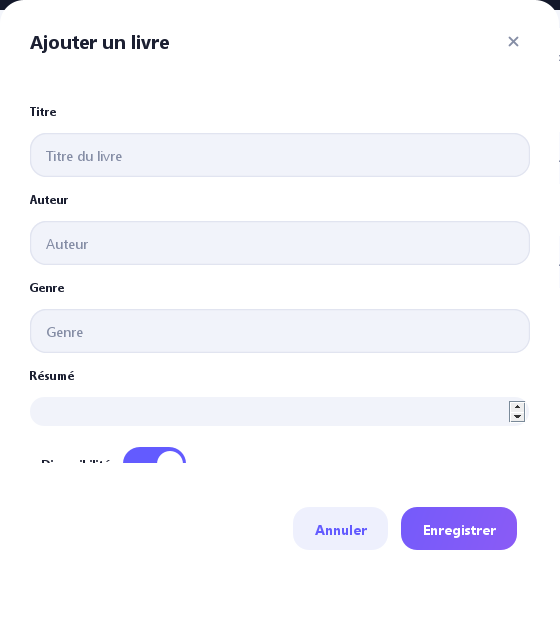
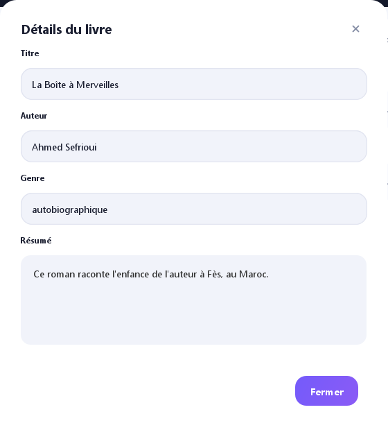
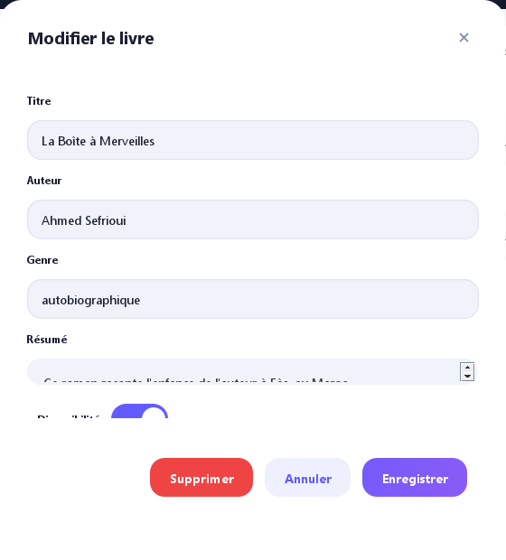
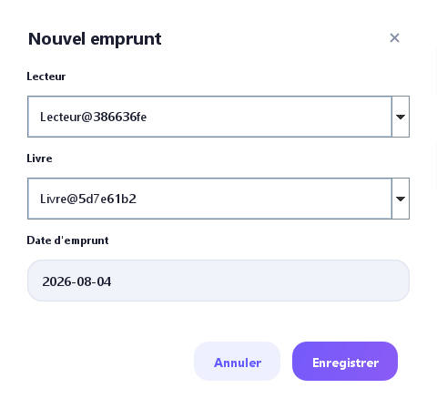
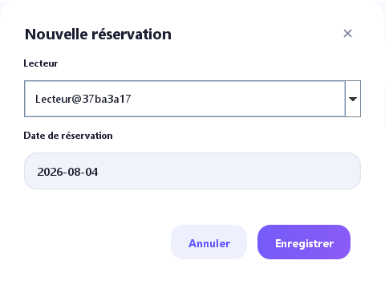

# Gestion de Bibliothèque (Biblio-Java)

Application de bureau en **Java / Swing** pour la gestion d'une bibliothèque : livres, emprunts, réservations et utilisateurs, avec persistance **PostgreSQL** (Neon).

Interface moderne : thème sombre, fenêtres sans bordures déplaçables, cartes, tableaux stylisés et notifications « toast ».

## Fonctionnalités

- **Authentification** : connexion par identifiant avec rôles **Admin** et **Lecteur**.
- **Tableau de bord** : statistiques (livres, emprunts actifs, réservations, utilisateurs) et accès rapide aux sections.
- **Catalogue** : liste des livres avec **recherche** (titre, auteur, genre) et **filtres**, ajout / modification / détails / suppression d'un livre.
- **Emprunts** : consultation des emprunts et **création d'un emprunt** (livre + lecteur + date).
- **Réservations** : consultation des réservations et **création d'une réservation**.
- **Utilisateurs** : liste des membres (lecteurs et administrateurs).

## Comptes de démonstration

| Rôle | Identifiant | Mot de passe |
| --- | --- | --- |
| Admin | `admin` | `admin123` |
| Lecteur | `lecteur` | `lecteur123` |

## Configuration de la base de données

La connexion est lue depuis la variable d'environnement `DATABASE_URL` (URL JDBC ou bien `postgresql://...` simple, qui est convertie automatiquement).

Exemple pour une base **Neon / PostgreSQL** :

```
DATABASE_URL=jdbc:postgresql://<hote>/neondb?user=<utilisateur>&password=<mot_de_passe>&sslmode=require
```

Le pilote JDBC est fourni dans `lib/postgresql-42.7.4.jar`. La table `livres` (et les données de démonstration) est créée automatiquement au premier lancement.

## Compilation et exécution

```bash
# Compilation
javac -encoding UTF-8 -cp "lib/postgresql-42.7.4.jar" -d out src/*.java src/gui/*.java

# Exécution
java -cp "out;lib/postgresql-42.7.4.jar" GUI_Main
```

## Interfaces

### Écran de connexion


Authentification par identifiant et mot de passe. L'application se connecte à la base de données et ouvre l'interface correspondant au rôle (Admin ou Lecteur).

### Tableau de bord


Vue d'ensemble : statistiques (nombre de livres, emprunts actifs, réservations, utilisateurs) et boutons d'accès rapide vers les différentes sections.

### Catalogue


Liste des livres sous forme de cartes avec recherche par titre / auteur / genre, filtres de disponibilité, et actions (ajouter, modifier, voir les détails, supprimer).

### Emprunts


Tableau des emprunts (livre, lecteur, dates). Permet de suivre les emprunts en cours et d'en créer de nouveaux.

### Réservations


Tableau des réservations (livre, lecteur, date) avec possibilité de créer une nouvelle réservation.

### Utilisateurs


Liste des utilisateurs (lecteurs et administrateurs) avec leurs informations de contact et leur rôle.

### Ajouter un livre



Formulaire de création d'un livre (titre, auteur, genre, description, disponibilité).

### Détails d'un livre



Affichage complet des informations d'un livre.

### Modifier un livre



Formulaire de modification pré-rempli avec les données du livre sélectionné.

### Nouvel emprunt



Dialogue de création d'un emprunt : choix du livre et du lecteur, date d'emprunt.

### Nouvelle réservation



Dialogue de création d'une réservation : choix du livre et du lecteur.
