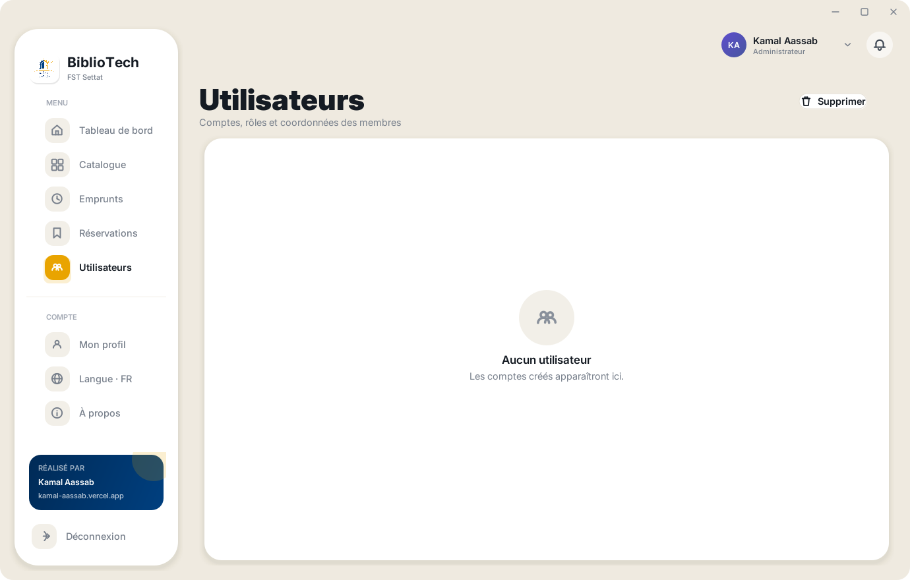

# BiblioTech — Gestion de Bibliothèque

<p align="center">
  
</p>

<p align="center">
  <strong>Faculté des Sciences et Techniques de Settat</strong><br>
  Conçu et développé par <a href="https://kamal-aassab.vercel.app/">Kamal Aassab</a>
</p>

---

Un seul projet, deux interfaces qui partagent la même base PostgreSQL (Neon) : une
application **bureau Java Swing** et une **application web Next.js** déployable sur
Vercel. Même identité visuelle, mêmes données, mêmes comptes. Interface bilingue
français / anglais, commutable à tout moment.

---

## ▶ Lancer l'application

**Double-cliquez sur le fichier voulu, à la racine du projet :**

| Fichier | Ce qu'il fait |
| --- | --- |
| **`START-DESKTOP-APP.bat`** | Compile puis lance l'application **bureau**. C'est tout. |
| **`START-WEB-APP.bat`** | Lance l'application **web**, puis ouvre `http://localhost:3000`. |

Les deux scripts **trouvent le JDK et Node tout seuls** — y compris une installation
portable non ajoutée au `PATH` — et **laissent la fenêtre ouverte** en cas d'erreur,
avec la marche à suivre.

> Avant le premier lancement, configurez la base de données : voir
> [Démarrage](#démarrage).

macOS / Linux : `./desktop/build.sh run`

---

## Identité visuelle

Toute la palette est **échantillonnée dans le blason de la FST Settat**
(`desktop/assets/fsts_logo.png`). Le blason n'utilise que deux encres, reprises telles
quelles comme jetons de design :

| Rôle | Couleur | Valeur | Usage |
| --- | --- | --- | --- |
| **1. Primaire** | Bleu marine | `#084888` | Actions, navigation active, titres, panneau de connexion |
| **2. Secondaire** | Or | `#F8A808` | L'accent qui marque la surface sélectionnée ou notable |
| **3. Tertiaire** | Blanc | `#FFFFFF` | Cartes et panneaux, sur un fond `#F1F5FA` à peine teinté de bleu |

Chaque autre valeur de l'interface est une teinte ou une nuance de ces deux tons :
l'application n'introduit aucune couleur absente du blason. Les ombres elles-mêmes sont
teintées de bleu marine plutôt que de gris neutre, pour qu'une élévation sur le fond
clair ne paraisse jamais sale.

Les deux clients partagent le même barème, à maintenir synchronisé :
`desktop/src/gui/Theme.java` ↔ `web/src/app/globals.css`.

---

## Structure

```
.
├── START-DESKTOP-APP.bat   <-- DOUBLE-CLIC pour l'app bureau
├── START-WEB-APP.bat       <-- DOUBLE-CLIC pour l'app web
├── README.md
├── .env.example            Modele a copier vers .env
│
├── desktop/                Application bureau - Java 17 + Swing
│   ├── src/                Modele, securite, i18n, couche donnees
│   │   ├── gui/            Design system et vues
│   │   └── Interfaces/     Stubs du sujet, exclus de la compilation
│   ├── assets/             Blason FST + fontes Inter
│   ├── lib/                Pilote PostgreSQL + FlatLaf (.jar)
│   ├── packaging/          Installeur Windows autonome (pas requis)
│   ├── find-jdk.bat        Localise le JDK - appele par les scripts
│   ├── build.bat / .sh     Compilation seule
│   ├── run.bat             Compilation + lancement
│   └── out/                Classes compilees (genere, ignore par Git)
│
├── web/                    Application web - Next.js 16 + React 19
│   ├── src/app/            App Router : pages et Route Handlers
│   ├── src/components/     shadcn/ui + composants metier
│   ├── src/lib/            Session, mots de passe, requetes, validation, i18n
│   ├── scripts/
│   │   ├── seed.mjs        Schema, sequences, donnees de demonstration
│   │   ├── fetch-covers.mjs  Resolution des couvertures
│   │   └── connection.mjs  Normalisation de la chaine de connexion
│   └── .env.local.example  Modele a copier vers .env.local
│
└── docs/screenshots/       Captures d'ecran
```

Les fichiers `.env` et `.env.local` contiennent les identifiants et ne sont **jamais**
versionnés. Copiez les modèles `.example` correspondants.

| Couche | Technologie |
| --- | --- |
| Bureau | Java 17, Swing, JDBC, PBKDF2 |
| Web | Next.js 16, React 19, TypeScript, Tailwind CSS 4, shadcn/ui, Framer Motion |
| Base | Neon PostgreSQL (serverless) |
| Hébergement | Vercel |

> **Fichiers partagés à garder synchronisés**
> `desktop/src/Security.java` ↔ `web/src/lib/password.ts` (format de hachage),
> `desktop/src/I18n.java` ↔ `web/src/lib/i18n.ts` (clés de traduction),
> `desktop/src/gui/Theme.java` ↔ `web/src/app/globals.css` (jetons de design).

---

## Fonctionnalités

### Connexion et rôles

Authentification par identifiant et mot de passe, avec deux rôles distincts.
L'**administrateur** gère le fonds, les prêts et les comptes ; le **lecteur** consulte
le catalogue et son propre dossier. Le rôle est vérifié à chaque route et à chaque page,
jamais seulement à l'affichage : masquer un bouton ne protège rien.

La limitation des tentatives est **par identifiant**, avec temporisation exponentielle.
Un attaquant qui cible un compte ne peut donc pas bloquer les autres utilisateurs.

### Tableau de bord

Quatre indicateurs — livres au catalogue, exemplaires disponibles, emprunts en cours,
réservations — accompagnés du nombre de retards. En dessous, les ajouts récents au fonds
et des actions rapides vers les tâches courantes.

### Catalogue

Le fonds complet, en grille de cartes. Recherche instantanée par titre, auteur ou genre ;
filtre par catégorie ; filtre par disponibilité (tous / disponibles / empruntés).
L'administrateur peut ajouter, modifier et supprimer un ouvrage.

**Couvertures réelles.** Le catalogue stocke une URL de couverture par livre, résolue par
`npm run db:covers` depuis Open Library, avec repli sur Google Books. Chaque candidat est
vérifié contre le titre et l'auteur locaux avant d'être accepté — une recherche sur
« Antigone » renvoie sinon volontiers une édition sans rapport. Sur les 160 ouvrages du
fonds, **148 obtiennent une couverture**.

C'est une *URL* qui est stockée, jamais l'image : les couvertures sont protégées par le
droit d'auteur et les deux services les diffusent précisément pour l'affichage en
catalogue. Le dépôt reste donc exempt d'illustrations redistribuées. Un livre sans
correspondance conserve sa **couverture générée** — un dégradé déduit du genre, ou à
défaut du hachage du titre, avec le titre et l'auteur composés dessus. Cette couverture
générée sert aussi de repli si le chargement échoue : une URL morte n'affiche jamais une
image cassée.

Côté bureau, `CoverCache` télécharge sur un pool de threads en arrière-plan, avec un cache
mémoire et un cache disque : le fil d'événements Swing ne bloque jamais, et un redémarrage
ne retélécharge pas toute l'étagère.

### Emprunts

Le registre des prêts : lecteur, ouvrage, date d'emprunt, retour prévu et statut. Le
statut est calculé à l'affichage et distingue **en cours**, **échéance aujourd'hui**,
**échéance proche** et **en retard**, avec le nombre exact de jours. L'enregistrement d'un
retour se fait en un clic.

Emprunts et retours s'exécutent dans une **transaction avec verrouillage de ligne**, pour
qu'un même exemplaire ne puisse pas être prêté deux fois par deux clients simultanés.

### Réservations

Les demandes des lecteurs, avec leur date, du plus récent au plus ancien. Création et
annulation par l'administrateur.

### Utilisateurs

L'annuaire des comptes : nom, adresse électronique, numéro et rôle. Création, modification
de rôle et suppression réservées à l'administrateur. Un index unique sur `LOWER(nom)`
garantit un identifiant, un compte.

### Profil

Coordonnées de l'utilisateur connecté et changement de mot de passe, avec vérification du
mot de passe actuel.

### Bilingue

Français et anglais, commutables à tout moment depuis la barre latérale. Le choix est
mémorisé d'une session à l'autre. Les deux clients partagent les mêmes clés de traduction.

---

## Démarrage

### 1. Base de données

Créez un projet sur [Neon](https://console.neon.tech), puis :

```bash
cp .env.example .env          # puis renseignez DATABASE_URL
cd web && cp .env.local.example .env.local
```

Générer le secret de session :

```bash
node -e "console.log(require('crypto').randomBytes(32).toString('base64url'))"
```

Créer le schéma et les données de démonstration :

```bash
cd web
npm install
npm run db:seed
```

`db:seed` est idempotent : il crée le schéma, **attache une séquence à chaque clé
primaire**, applique les migrations et laisse les données existantes intactes.

Pour ajouter les dix scénarios de prêt de démonstration à un registre déjà peuplé :

```bash
npm run db:seed -- --scenarios
```

Pour résoudre les couvertures :

```bash
npm run db:covers        # seulement les livres sans couverture
npm run db:covers -- --all   # tout re-résoudre
```

### 2. Bureau

Double-cliquez **`START-DESKTOP-APP.bat`**. En ligne de commande :

```bash
desktop\run.bat          # Windows — compile puis lance
./desktop/build.sh run   # macOS / Linux
```

Le JDK est recherché dans `JAVA_HOME`, puis sur le `PATH`, puis dans les emplacements
d'installation courants — y compris une archive décompressée manuellement
(`desktop\find-jdk.bat`). Si rien n'est trouvé, le script explique comment installer
Temurin 17 ou définir `JAVA_HOME`.

> Le client bureau se connecte à Neon en **TCP direct sur le port 5432**. Derrière un
> proxy d'entreprise qui filtre ce port, la connexion échoue et les vues restent vides —
> l'application démarre normalement, mais sans données. Le client web n'a pas ce
> problème : il passe par le pilote *serverless* de Neon, en HTTPS.

### 3. Web

Double-cliquez **`START-WEB-APP.bat`**. En ligne de commande :

```bash
cd web
npm run dev          # http://localhost:3000
npm run typecheck    # verification TypeScript
npm run build        # build de production
```

---

## Jeu de démonstration

`npm run db:seed -- --scenarios` crée dix situations de prêt couvrant chaque état que
l'interface rend différemment. Toutes les dates sont **relatives au jour d'exécution** :
« en retard de trois jours » le reste quand la démonstration est ouverte des mois plus
tard, au lieu de dériver dans le passé.

| # | Scénario | État affiché |
| --- | --- | --- |
| 1 | Ouvert aujourd'hui, période complète restante | Dans 14 jours |
| 2 | En cours, une semaine restante | Dans 7 jours |
| 3 | Échéance demain | Dans 1 jour |
| 4 | Échéance aujourd'hui | Aujourd'hui |
| 5 | En retard de 3 jours | 3 jours de retard |
| 6 | En retard de 5 semaines | 35 jours de retard |
| 7 | Rendu une semaine en avance | Rendu |
| 8 | Rendu le jour même de l'échéance | Rendu |
| 9 | Rendu avec 8 jours de retard | Rendu |
| 10 | Prêt historique clos, semestre précédent | Rendu |

S'y ajoutent huit réservations réparties sur les trois dernières semaines et quatre
lecteurs supplémentaires, pour que le registre ne soit pas un seul nom répété dix fois.

Les scénarios ne s'attachent qu'à des ouvrages **sans prêt ouvert** — c'est le registre
qui fait foi, pas l'indicateur `disponibilite`, qui est dénormalisé et peut être périmé.

---

## Déploiement Vercel

1. **Créez une branche Neon dédiée à la démo.** Ne pointez jamais le déploiement public
   vers votre base principale.

2. **Importez le dépôt sur Vercel** et réglez **Root Directory** sur `web`.

3. **Variables d'environnement** (Project → Settings → Environment Variables) :

   ```text
   DATABASE_URL     = postgresql://...   (branche de demo)
   SESSION_SECRET   = ...                (nouvelle valeur, differente du local)
   DEMO_MODE        = true
   ```

   Aucune n'est préfixée `NEXT_PUBLIC_`, donc **rien n'atteint le navigateur**. Une
   importation accidentelle côté client ferait échouer le build.

4. **Initialisez la base de démo** une fois, depuis votre machine, avec `.env.local`
   pointé sur cette branche : `npm run db:seed`.

5. **Déployez.**

En `DEMO_MODE`, les comptes de démonstration ne peuvent être ni renommés, ni supprimés,
ni voir leur mot de passe modifié — le lien public reste fonctionnel dans la durée.

---

## Sécurité

### Secrets

- Aucune information d'identification dans le code source.
- `.gitignore` exclut `.env`, `.env.*`, `config.properties`, clés et certificats.
- Journaux et messages d'erreur passent par une fonction de rédaction qui masque mots
  de passe et chaînes de connexion.

### Authentification

- **PBKDF2-HMAC-SHA256**, 210 000 itérations, sel de 16 octets (référence OWASP).
- Comparaison à **temps constant** ; un identifiant inexistant effectue le même travail
  cryptographique qu'un mot de passe erroné, pour ne pas révéler quels comptes existent.
- Les anciennes lignes en clair sont **migrées automatiquement** à la première connexion
  réussie de leur propriétaire.
- Limitation des tentatives avec temporisation exponentielle **par identifiant**.

### Web

| Protection | Mise en œuvre |
| --- | --- |
| Sessions | Cookie `httpOnly`, `SameSite=Lax`, `Secure`, signé HMAC-SHA256, 8 h |
| CSRF | Jeton double-soumission vérifié sur chaque écriture |
| En-têtes | CSP, HSTS, `X-Frame-Options`, `X-Content-Type-Options`, `Permissions-Policy`, COOP/CORP |
| Injection SQL | Requêtes paramétrées uniquement (templates balisés) |
| Validation | Schémas Zod ; caractères de contrôle, surcharges bidirectionnelles et caractères invisibles supprimés |
| Autorisation | `requireSession()` / `requireAdmin()` sur chaque route et chaque page |
| Limitation de débit | Par IP, sur la connexion, les écritures et le changement de mot de passe |
| Redirections | `?next=` restreint aux chemins internes (pas de redirection ouverte) |
| Indexation | `robots: noindex` sur la démo |

La politique CSP n'autorise que deux hôtes tiers, et uniquement pour les images :
`covers.openlibrary.org` et `books.google.com`, nommés explicitement plutôt que par
joker. Les couvertures sont le seul contenu externe chargé par l'application.

> **Note honnête sur le limiteur de débit** — il est en mémoire, donc son périmètre est
> l'instance serverless, pas le déploiement entier. C'est le bon compromis pour une
> démonstration ; une mise en production sous trafic réel devrait le déplacer vers
> Upstash/Redis, sans changer les appels.

> **Note sur le proxy Edge** — `web/src/proxy.ts` vérifie uniquement la *présence* du
> cookie de session : l'Edge runtime n'a pas accès à `node:crypto` et ne peut donc pas
> valider la signature. L'autorisation réelle a lieu dans chaque route et chaque page.

### Base de données

- TLS forcé (`sslmode=require`), même si l'URL fournie demande autre chose.
- Contraintes de clés étrangères avec `ON DELETE CASCADE`.
- Index unique sur `LOWER(nom)` — un identifiant, un compte.
- Identifiants générés par **séquences PostgreSQL**, remplaçant l'ancien `MAX(id) + 1`
  qui perdait silencieusement des écritures concurrentes. Les deux clients installent ces
  séquences : le client bureau à la connexion, `npm run db:seed` côté web — une base que
  l'application Java n'a jamais atteinte est ainsi utilisable malgré tout.
- Emprunts et retours en **transaction** avec verrouillage de ligne.

---

## Captures d'écran

> Les captures ci-dessous ont été prises **avant** la reprise de la palette et
> l'ajout des scénarios de démonstration : elles montrent l'ancien fond ivoire.
> Pour les régénérer, depuis une machine dont l'accès au port 5432 n'est pas filtré :
>
> ```bash
> desktop\build.bat
> cd desktop && java -cp "out;lib\postgresql-42.7.4.jar;lib\flatlaf-3.5.4.jar" GenerateScreenshots
> ```
>
> Les sept fichiers de `docs/screenshots/` sont réécrits en place.

| Capture | Ce qu'elle montre |
| --- | --- |
|  | **Connexion** — panneau institutionnel à gauche, formulaire à droite. Le blason est posé sur une plaque blanche : c'est le seul endroit où elle subsiste, le panneau étant bleu marine comme l'encre du blason lui-même. Les comptes de démonstration sont rappelés en bas. |
|  | **Tableau de bord** — les quatre indicateurs en haut, le nombre de retards en légende, puis les ajouts récents au fonds et les actions rapides. |
|  | **Catalogue** — la grille de couvertures, la recherche instantanée, le filtre par catégorie et les trois onglets de disponibilité. Chaque carte porte le titre, l'auteur, l'état et le genre. |
|  | **Emprunts** — le registre des prêts. La colonne statut distingue les prêts en cours, l'échéance du jour et les retards, en indiquant le nombre exact de jours ; le bouton de retour clôt le prêt en un clic. |
|  | **Réservations** — les demandes des lecteurs, les plus récentes en tête, avec leur date et le lecteur concerné. |
|  | **Utilisateurs** — l'annuaire des comptes avec nom, adresse, numéro et rôle. Les actions de modification et de suppression sont réservées à l'administrateur. |
|  | **Profil** — les coordonnées du compte connecté et le formulaire de changement de mot de passe. |

---

## Comptes de démonstration

| Rôle | Identifiant | Mot de passe |
| --- | --- | --- |
| Administrateur | `admin` | `admin123` |
| Lecteur | `lecteur` | `lecteur123` |

Le jeu de démonstration ajoute quatre lecteurs supplémentaires — Salma Bennani,
Youssef El Amrani, Nadia Cherkaoui et Omar Tazi — tous avec le mot de passe `lecteur123`.

> Ces identifiants sont destinés à la démonstration. Changez-les avant tout usage réel.

---

<p align="center">
  <sub>
    Projet académique — Faculté des Sciences et Techniques de Settat<br>
    <a href="https://kamal-aassab.vercel.app/">kamal-aassab.vercel.app</a>
  </sub>
</p>
