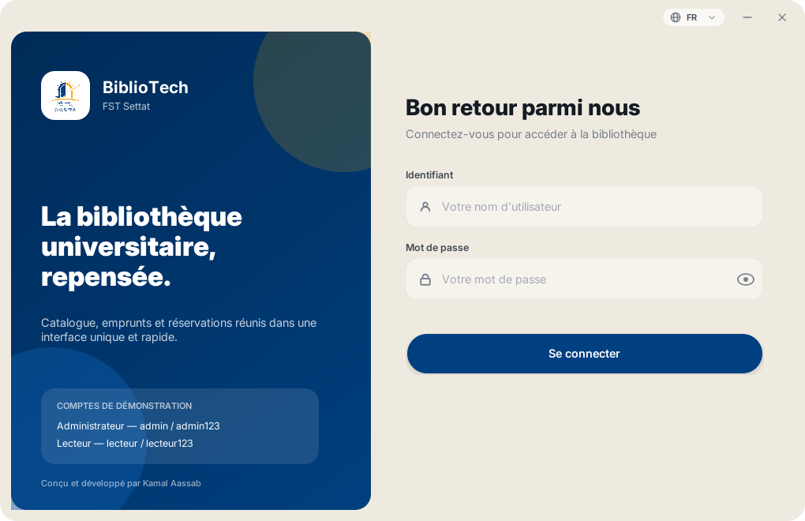
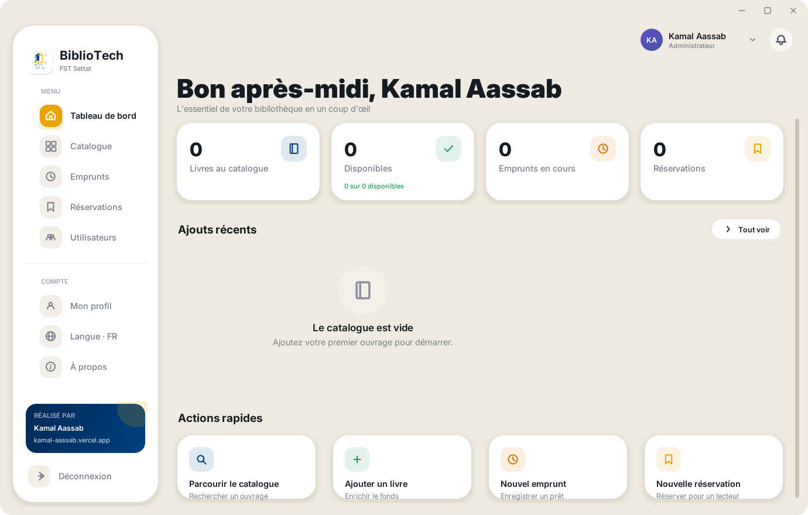
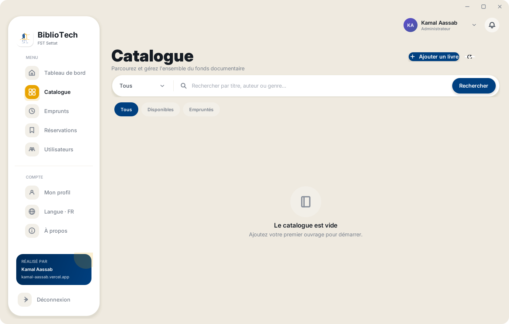
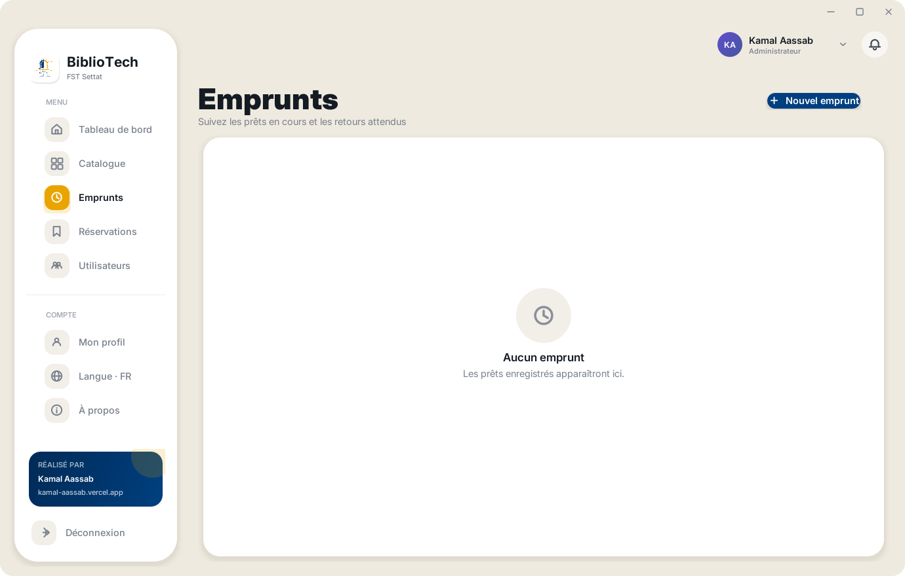
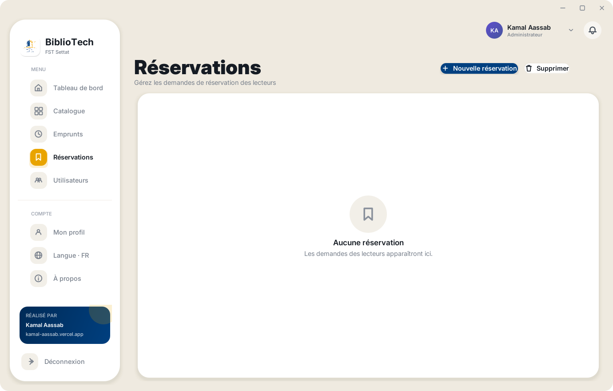
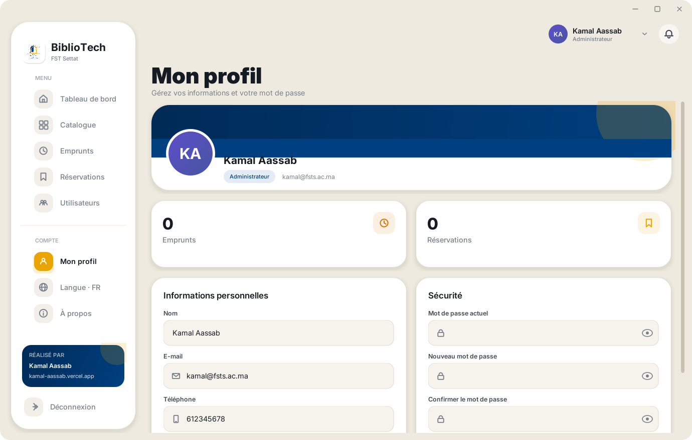

# BiblioTech — Gestion de Bibliothèque · Library Management

<p align="center">
  
</p>

<p align="center">
  <strong>Faculté des Sciences et Techniques de Settat</strong><br>
  Conçu et développé par <a href="https://kamal-aassab.vercel.app/">Kamal Aassab</a><br>
  <em>Designed and built by <a href="https://kamal-aassab.vercel.app/">Kamal Aassab</a></em>
</p>

---

**FR** — Un seul projet, deux interfaces qui partagent la même base PostgreSQL (Neon) :
une application **bureau Java Swing** et une **application web Next.js** déployable sur
Vercel. Même identité visuelle, mêmes données, mêmes comptes. Interface bilingue
français / anglais.

**EN** — One project, two interfaces sharing a single PostgreSQL (Neon) database: a
**Java Swing desktop app** and a **Next.js web app** deployable to Vercel. Same visual
identity, same data, same accounts. Bilingual French / English interface.

---

## Structure

```
.
├── desktop/              Application bureau — Java 17 + Swing
│   ├── src/              Modele, securite, i18n, couche donnees
│   │   └── gui/          Design system et vues
│   ├── assets/           Logo FST + fontes Inter
│   ├── lib/              Pilote PostgreSQL + FlatLaf
│   ├── build.bat / .sh   Compilation
│   └── run.bat           Compilation + lancement
│
├── web/                  Application web — Next.js 16 + React 19
│   ├── src/app/          App Router : pages et Route Handlers
│   ├── src/components/   shadcn/ui + composants metier
│   ├── src/lib/          Session, mots de passe, requetes, validation, i18n
│   └── scripts/seed.mjs  Migration de schema + donnees de demonstration
│
├── docs/screenshots/     Captures d'ecran
├── .env                  Configuration bureau (ignoree par Git)
└── .env.example          Modele a copier
```

Les deux interfaces écrivent dans les **mêmes tables**. Les mots de passe utilisent un
format identique (`pbkdf2$210000$sel$empreinte`), donc un compte créé côté bureau se
connecte côté web et inversement.

*Both interfaces write to the **same tables**. Passwords use an identical format, so an
account created on the desktop signs in on the web and vice versa.*

| Couche · Layer | Technologie |
| --- | --- |
| Bureau · Desktop | Java 17, Swing, JDBC, PBKDF2 |
| Web | Next.js 16, React 19, TypeScript, Tailwind CSS 4, shadcn/ui, Framer Motion |
| Base · Database | Neon PostgreSQL (serverless) |
| Hébergement · Hosting | Vercel |

> **Fichiers partagés à garder synchronisés · Keep these in sync**
> `desktop/src/Security.java` ↔ `web/src/lib/password.ts` (format de hachage),
> `desktop/src/I18n.java` ↔ `web/src/lib/i18n.ts` (clés de traduction),
> `desktop/src/gui/Theme.java` ↔ `web/src/app/globals.css` (jetons de design).

---

## Démarrage · Getting started

### 1. Base de données · Database

Créez un projet sur [Neon](https://console.neon.tech), puis :

```bash
cp .env.example .env          # puis renseignez DATABASE_URL
cd web && cp .env.local.example .env.local
```

Générer le secret de session :

```bash
node -e "console.log(require('crypto').randomBytes(32).toString('base64url'))"
```

Créer le schéma et les données de démonstration :

```bash
cd web
npm install
npm run db:seed
```

### 2. Bureau · Desktop

```bash
desktop\run.bat          # Windows — compile puis lance
./desktop/build.sh run   # macOS / Linux
```

Sous Windows, `desktop\Biblio-Java.exe` lance également l'application.
Les scripts fonctionnent depuis n'importe quel dossier et détectent le JDK via
`JAVA_HOME`, sinon `javac` / `java` du `PATH`.

### 3. Web

```bash
cd web
npm run dev          # http://localhost:3000
npm run typecheck    # verification TypeScript
npm run build        # build de production
```

---

## Déploiement Vercel · Vercel deployment

1. **Créez une branche Neon dédiée à la démo.** Ne pointez jamais le déploiement public
   vers votre base principale.
   *Create a dedicated Neon branch for the demo — never point the public deployment at
   your main database.*

2. **Importez le dépôt sur Vercel** et réglez **Root Directory** sur `web`.

3. **Variables d'environnement** (Project → Settings → Environment Variables) :

   ```text
   DATABASE_URL     = postgresql://...   (branche de demo)
   SESSION_SECRET   = ...                (nouvelle valeur, differente du local)
   DEMO_MODE        = true
   ```

   Aucune n'est préfixée `NEXT_PUBLIC_`, donc **rien n'atteint le navigateur**. Une
   importation accidentelle côté client ferait échouer le build.

4. **Initialisez la base de démo** une fois, depuis votre machine, avec `.env.local`
   pointé sur cette branche : `npm run db:seed`.

5. **Déployez.**

En `DEMO_MODE`, les comptes de démonstration ne peuvent être ni renommés, ni supprimés,
ni voir leur mot de passe modifié — le lien public reste fonctionnel dans la durée.

---

## Sécurité · Security

### Secrets

- Aucune information d'identification dans le code source.
- `.gitignore` exclut `.env`, `.env.*`, `config.properties`, clés et certificats.
- Journaux et messages d'erreur passent par une fonction de rédaction qui masque mots
  de passe et chaînes de connexion.

### Authentification

- **PBKDF2-HMAC-SHA256**, 210 000 itérations, sel de 16 octets (référence OWASP).
- Comparaison à **temps constant** ; un identifiant inexistant effectue le même travail
  cryptographique qu'un mot de passe erroné, pour ne pas révéler quels comptes existent.
- Les anciennes lignes en clair sont **migrées automatiquement** à la première connexion
  réussie de leur propriétaire.
- Limitation des tentatives avec temporisation exponentielle **par identifiant** — un
  attaquant ciblant un compte ne peut pas bloquer les autres utilisateurs.

### Web

| Protection | Mise en œuvre |
| --- | --- |
| Sessions | Cookie `httpOnly`, `SameSite=Lax`, `Secure`, signé HMAC-SHA256, 8 h |
| CSRF | Jeton double-soumission vérifié sur chaque écriture |
| En-têtes | CSP, HSTS, `X-Frame-Options`, `X-Content-Type-Options`, `Permissions-Policy`, COOP/CORP |
| Injection SQL | Requêtes paramétrées uniquement (templates balisés) |
| Validation | Schémas Zod ; caractères de contrôle, surcharges bidirectionnelles et caractères invisibles supprimés |
| Autorisation | `requireSession()` / `requireAdmin()` sur chaque route et chaque page |
| Limitation de débit | Par IP, sur la connexion, les écritures et le changement de mot de passe |
| Redirections | `?next=` restreint aux chemins internes (pas de redirection ouverte) |
| Indexation | `robots: noindex` sur la démo |

> **Note honnête sur le limiteur de débit** — il est en mémoire, donc son périmètre est
> l'instance serverless, pas le déploiement entier. C'est le bon compromis pour une
> démonstration ; une mise en production sous trafic réel devrait le déplacer vers
> Upstash/Redis, sans changer les appels.

> **Note sur le proxy Edge** — `web/src/proxy.ts` vérifie uniquement la *présence* du
> cookie de session : l'Edge runtime n'a pas accès à `node:crypto` et ne peut donc pas
> valider la signature. L'autorisation réelle a lieu dans chaque route et chaque page.

### Base de données

- TLS forcé (`sslmode=require`), même si l'URL fournie demande autre chose.
- Contraintes de clés étrangères avec `ON DELETE CASCADE`.
- Index unique sur `LOWER(nom)` — un identifiant, un compte.
- Identifiants générés par séquences PostgreSQL, remplaçant l'ancien `MAX(id) + 1` qui
  perdait silencieusement des écritures concurrentes.
- Emprunts et retours en **transaction** avec verrouillage de ligne, pour qu'un même
  exemplaire ne puisse pas être prêté deux fois.

---

## Fonctionnalités · Features

| Section | FR | EN |
| --- | --- | --- |
| Connexion | Authentification par rôle, comptes de démonstration | Role-based sign-in, demo accounts |
| Tableau de bord | Indicateurs, ajouts récents, actions rapides | Metrics, recent additions, quick actions |
| Catalogue | Recherche, filtres par catégorie et disponibilité | Search, category and availability filters |
| Emprunts | Suivi des prêts, retards, enregistrement des retours | Loan tracking, overdue flags, returns |
| Réservations | Demandes des lecteurs | Reader requests |
| Utilisateurs | Annuaire, rôles, suppression (admin) | Directory, roles, deletion (admin) |
| Profil | Coordonnées et changement de mot de passe | Details and password change |

Les deux interfaces basculent entre français et anglais à tout moment ; le choix est
mémorisé d'une session à l'autre.

---

## Captures d'écran · Screenshots

| | |
| --- | --- |
|  |  |
| **Connexion** — identité institutionnelle et accès par rôle | **Tableau de bord** — indicateurs et ajouts récents |
|  |  |
| **Catalogue** — recherche et filtres | **Emprunts** — suivi des prêts et des retards |
|  |  |
| **Réservations** — demandes des lecteurs | **Profil** — informations et mot de passe |

---

## Comptes de démonstration · Demo accounts

| Rôle · Role | Identifiant · Username | Mot de passe · Password |
| --- | --- | --- |
| Administrateur · Administrator | `admin` | `admin123` |
| Lecteur · Reader | `lecteur` | `lecteur123` |

> Ces identifiants sont destinés à la démonstration. Changez-les avant tout usage réel.
> *These credentials are for demonstration only. Change them before any real use.*

---

<p align="center">
  <sub>
    Projet académique — Faculté des Sciences et Techniques de Settat<br>
    <a href="https://kamal-aassab.vercel.app/">kamal-aassab.vercel.app</a>
  </sub>
</p>
