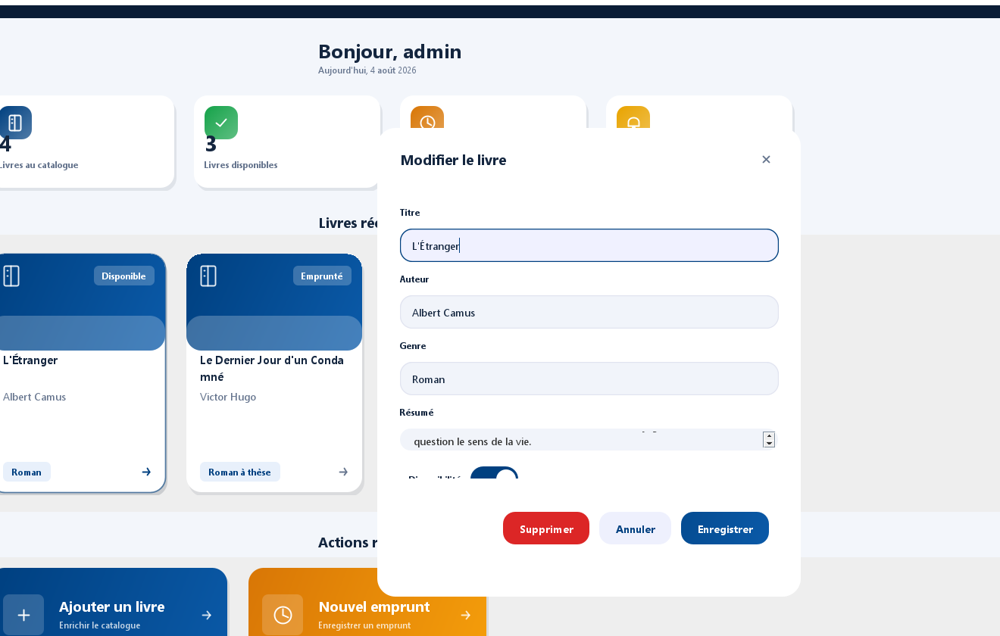
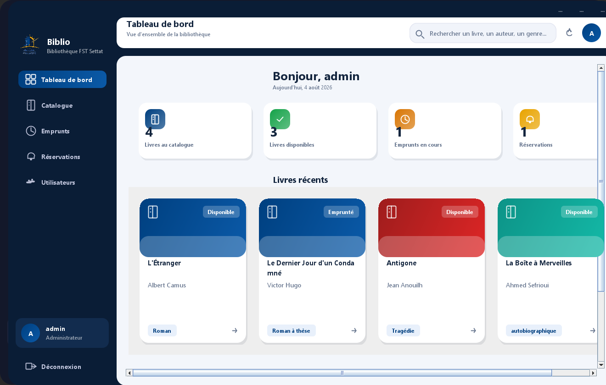
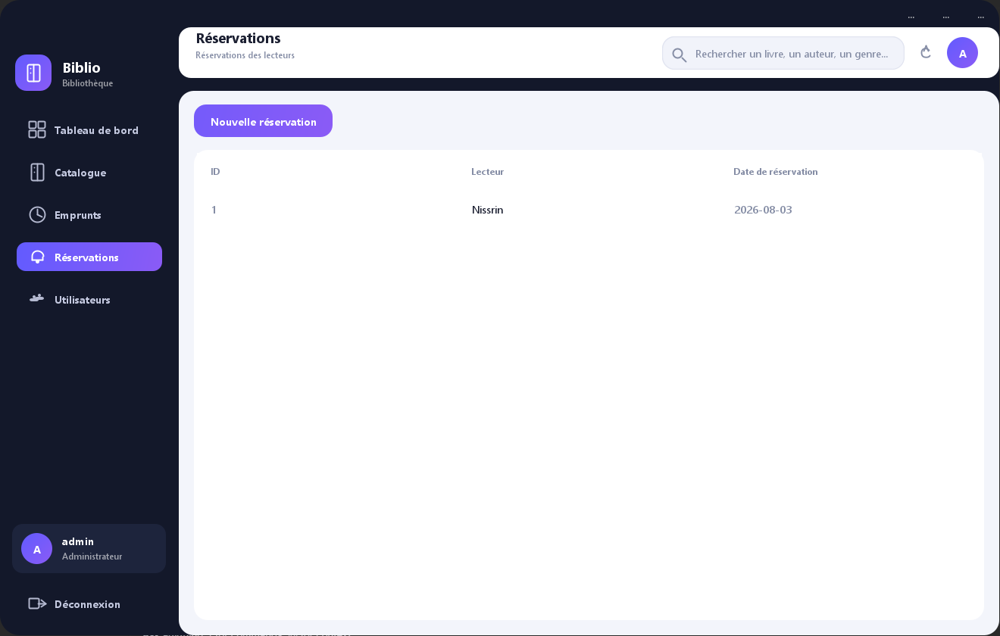
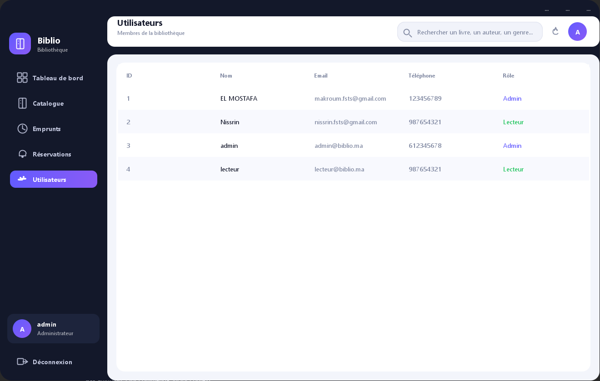

# Gestion de Bibliothèque (Biblio-Java)

Application de bureau en **Java / Swing** pour la gestion d'une bibliothèque : livres, emprunts, réservations et utilisateurs, avec persistance **PostgreSQL** (Neon).

Interface moderne : thème sombre, fenêtres sans bordures déplaçables, cartes, tableaux stylisés et notifications « toast ».

## Fonctionnalités

- **Authentification** : connexion par identifiant avec rôles **Admin** et **Lecteur**.
- **Tableau de bord** : statistiques (livres, emprunts actifs, réservations, utilisateurs) et accès rapide aux sections.
- **Catalogue** : liste des livres avec **recherche** (titre, auteur, genre) et **filtres**, ajout / modification / détails / suppression d'un livre.
- **Emprunts** : consultation des emprunts et **création d'un emprunt** (livre + lecteur + date).
- **Réservations** : consultation des réservations et **création d'une réservation**.
- **Utilisateurs** : liste des membres (lecteurs et administrateurs).

## Comptes de démonstration

| Rôle | Identifiant | Mot de passe |
| --- | --- | --- |
| Admin | `admin` | `admin123` |
| Lecteur | `lecteur` | `lecteur123` |

## Configuration de la base de données

La connexion est lue depuis la variable d'environnement `DATABASE_URL` (URL JDBC ou bien `postgresql://...` simple, qui est convertie automatiquement).

Exemple pour une base **Neon / PostgreSQL** :

```
DATABASE_URL=jdbc:postgresql://<hote>/neondb?user=<utilisateur>&password=<mot_de_passe>&sslmode=require
```

Le pilote JDBC est fourni dans `lib/postgresql-42.7.4.jar`. La table `livres` (et les données de démonstration) est créée automatiquement au premier lancement.

## Compilation et exécution

```bash
# Compilation
javac -encoding UTF-8 -cp "lib/postgresql-42.7.4.jar" -d out src/*.java src/gui/*.java

# Exécution
java -cp "out;lib/postgresql-42.7.4.jar" GUI_Main
```

## Interfaces

### Tableau de bord


Vue d'ensemble de la bibliothèque avec les indicateurs clés, les raccourcis vers les sections et l'accès rapide aux actions les plus utiles.

### Catalogue



Liste des livres en cartes avec recherche par titre, auteur ou genre, filtrage par catégorie et actions de gestion pour l'administration.

### Emprunts



Tableau de suivi des emprunts avec l'état de chaque prêt, les dates importantes et la création d'un nouvel emprunt.

### Réservations



Vue centralisée des réservations pour consulter l'historique et enregistrer une nouvelle réservation.

### Utilisateurs



Liste des membres de la bibliothèque avec le rôle, les coordonnées et la consultation rapide des comptes.

## Téléchargement

- [ZIP Windows 64 bits](dist/Biblio-Java-Windows-x64.zip)
- [EXE Windows 64 bits](dist/Biblio-Java-Windows-x64.exe)
